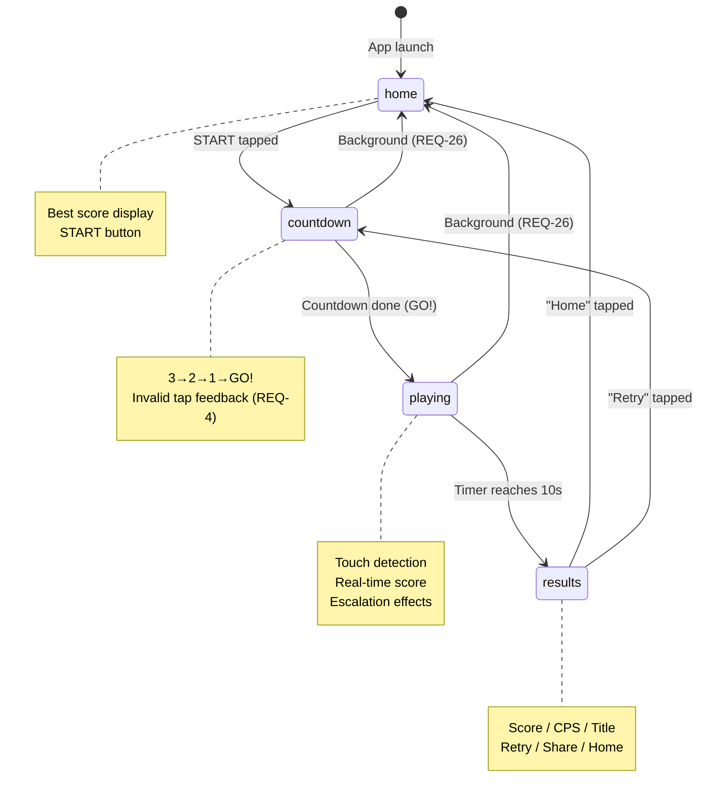
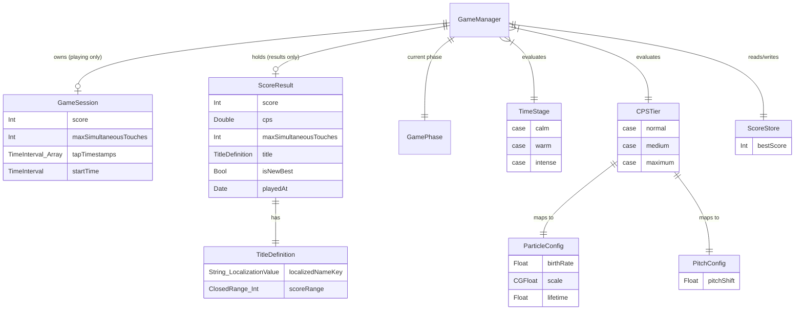
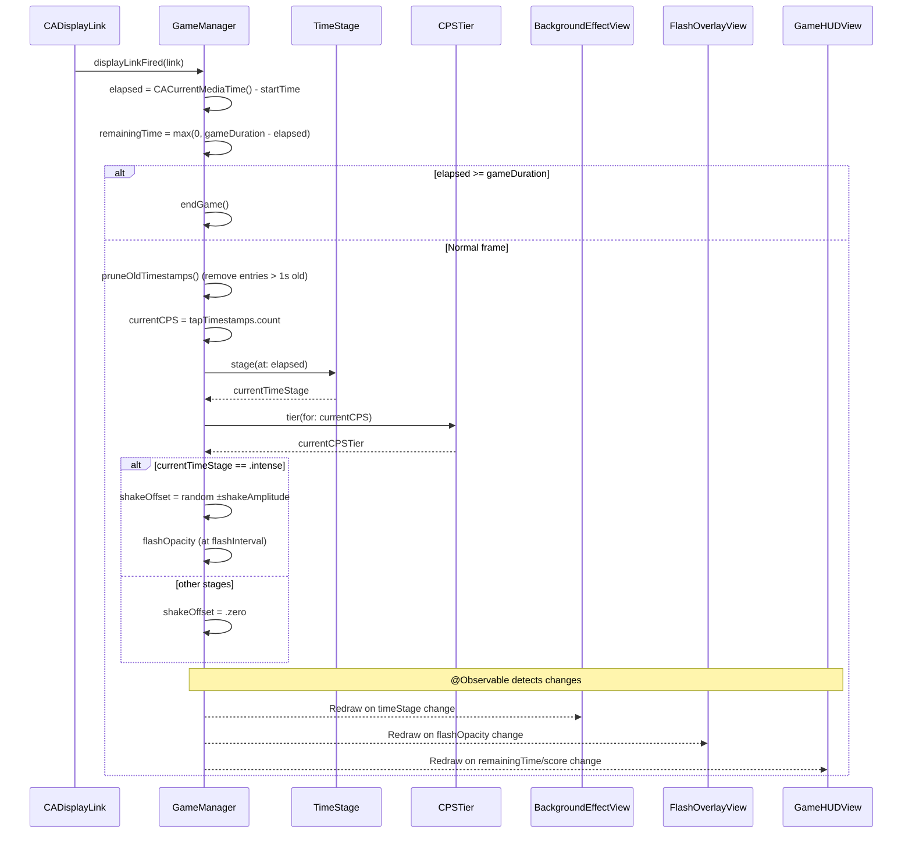
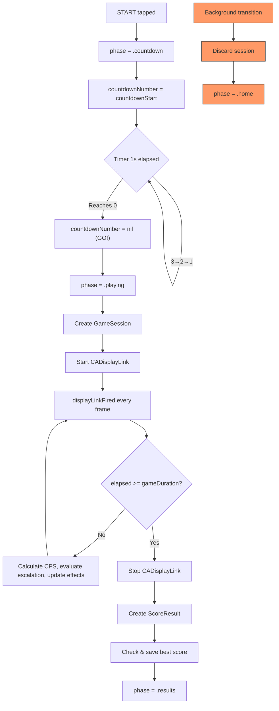
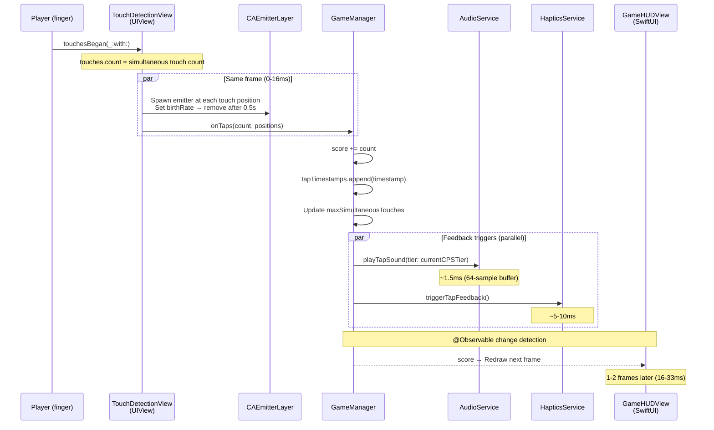
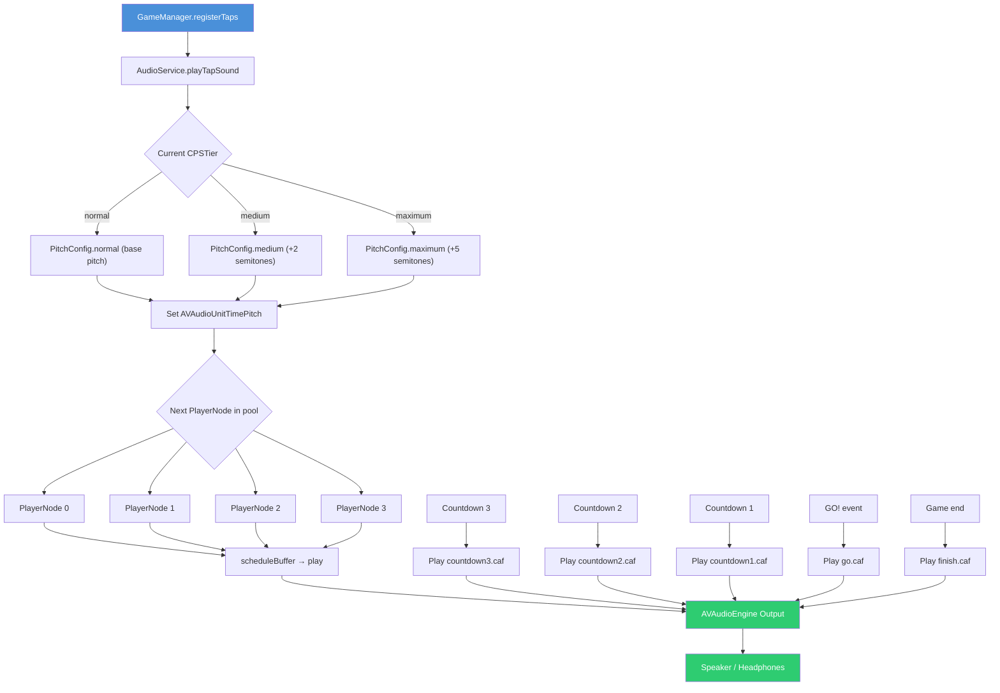
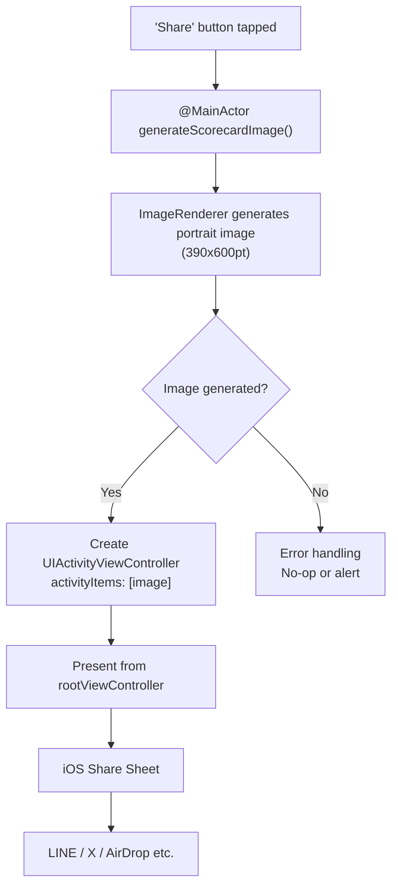

# TapBurst 設計書 / Design Document

> 対応要件定義書 / Requirements: [requirements.md](./requirements.md) v1.5

---

## 目次 / Table of Contents

0. [設計原則 / Design Principles](#0-設計原則--design-principles)
1. [フォルダ構成 / Folder Structure](#1-フォルダ構成--folder-structure)
2. [画面遷移 / Navigation](#2-画面遷移--navigation)
3. [データモデル / Data Models](#3-データモデル--data-models)
4. [状態管理 / State Management](#4-状態管理--state-management)
5. [ゲームエンジン / Game Engine](#5-ゲームエンジン--game-engine)
6. [ゲーム画面レイヤー構成 / Game Screen Layer Stack](#6-ゲーム画面レイヤー構成--game-screen-layer-stack)
7. [タッチ→スコア→表示パイプライン / Touch-to-Display Pipeline](#7-タッチスコア表示パイプライン--touch-to-display-pipeline)
8. [オーディオシステム / Audio System](#8-オーディオシステム--audio-system)
9. [視覚エフェクトシステム / Visual Effects System](#9-視覚エフェクトシステム--visual-effects-system)
10. [スコアカード＆シェア / Scorecard & Share](#10-スコアカードシェア--scorecard--share)
11. [データ永続化 / Data Persistence](#11-データ永続化--data-persistence)
12. [ローカライゼーション / Localization](#12-ローカライゼーション--localization)
13. [Xcodeプロジェクト設定変更 / Xcode Project Settings](#13-xcodeプロジェクト設定変更--xcode-project-settings)
14. [要件トレーサビリティマトリクス / Requirements Traceability Matrix](#14-要件トレーサビリティマトリクス--requirements-traceability-matrix)

---

## 0. 設計原則 / Design Principles

### 定数の局所化 / Constant Localization

グローバルな `Constants.swift` ファイルは作成しない。各定数は、それを使用する型の内部に `static let` / `static var` として定義する。これにより、定数の意味・用途が使用コンテキストから明確になり、変更時の影響範囲が局所化される。

Do not create a global `Constants.swift` file. Each constant is defined as a `static let` / `static var` inside the type that uses it. This makes the meaning and usage of each constant clear from context and localizes the impact of changes.

**原則 / Principle:** 定数は「何に属するか」で配置先を決める。型が定数を所有し、定数が型を定義する。

Constants are placed based on "what they belong to." The type owns its constants, and constants define the type.

```swift
// --- Good: 定数が使用コンテキストに属する / Constants belong to their usage context ---

enum TimeStage {
    case calm, warm, intense

    // Time thresholds defined where they are used
    private static let warmThreshold: TimeInterval = 5.0
    private static let intenseThreshold: TimeInterval = 8.0

    static func stage(at elapsed: TimeInterval) -> TimeStage { ... }
}

enum CPSTier {
    case normal, medium, maximum

    // CPS thresholds defined where they are used
    private static let mediumThreshold = 5
    private static let maximumThreshold = 15

    static func tier(for cps: Int) -> CPSTier { ... }
}

struct ParticleConfig {
    let birthRate: Float
    let scale: CGFloat
    let lifetime: Float

    // Particle parameters per tier, defined in the config type
    static let normal  = ParticleConfig(birthRate: 30,  scale: 0.5,  lifetime: 0.3)
    static let medium  = ParticleConfig(birthRate: 48,  scale: 0.75, lifetime: 0.4)
    static let maximum = ParticleConfig(birthRate: 64,  scale: 1.0,  lifetime: 0.5)
}

// --- Bad: グローバル定数ファイル / Global constants file ---
// struct Constants {
//     static let warmThreshold = 5.0       // What is this for?
//     static let mediumCPSThreshold = 5    // Disconnected from CPSTier
//     static let particleBirthRateNormal = 30  // Unrelated to ParticleConfig
// }
```

### 定数配置ガイド / Constant Placement Guide

| 定数カテゴリ / Category | 配置先 / Placement | 例 / Example |
|------------------------|-------------------|-------------|
| 時間閾値 / Time thresholds | `TimeStage` | `warmThreshold = 5.0` |
| CPS閾値 / CPS thresholds | `CPSTier` | `mediumThreshold = 5` |
| パーティクルパラメータ / Particle params | `ParticleConfig` | `.normal`, `.medium`, `.maximum` |
| ピッチパラメータ / Pitch params | `PitchConfig` | `.normal`, `.medium`, `.maximum` |
| ゲーム時間 / Game duration | `GameManager` | `gameDuration: TimeInterval = 10.0` |
| カウントダウン / Countdown | `GameManager` | `countdownStart = 3` |
| 振動範囲 / Shake range | `GameManager` | `shakeAmplitude: CGFloat = 3.0` |
| フラッシュ間隔 / Flash interval | `GameManager` | `flashInterval: TimeInterval = 0.7` |
| 音声バッファ / Audio buffer | `AudioService` | `preferredBufferSize = 64` |
| 触覚間引き / Haptic throttle | `HapticsService` | `minimumInterval: TimeInterval = 0.016` |
| ビネットopacity / Vignette opacity | `BackgroundEffectView` | `vignetteOpacity(for:)` |
| HUDフォントサイズ / HUD font size | `GameHUDView` | `scoreFontSize: CGFloat = 80` |
| スコアカードサイズ / Scorecard size | `ScorecardView` | `cardSize = CGSize(width: 390, height: 600)` |
| UserDefaultsキー / UserDefaults key | `ScoreStore` | `bestScoreKey = "bestScore"` |
| 称号テーブル / Title table | `TitleDefinition` | `static let allTitles: [TitleDefinition]` |

---

## 1. フォルダ構成 / Folder Structure

Xcode 26 の `PBXFileSystemSynchronizedRootGroup`（objectVersion 77）により、ファイルシステム上にフォルダを作成するだけで Xcode が自動認識する。pbxproj の手動編集は不要。

With Xcode 26's `PBXFileSystemSynchronizedRootGroup` (objectVersion 77), creating folders on the filesystem is sufficient for Xcode to auto-detect them. No manual pbxproj editing required.

```
TapBurst/
├── TapBurstApp.swift            ← Modify existing / 既存を修正（scenePhase監視追加）
├── ContentView.swift             ← Modify existing / 既存を修正（GamePhaseベースのルートView化）
├── Models/
│   ├── GamePhase.swift           ← Screen state enum / 画面状態enum
│   ├── GameSession.swift         ← In-progress session data / ゲームセッションデータ
│   ├── ScoreResult.swift         ← Immutable result data / 結果データ
│   ├── TitleDefinition.swift     ← Score→Title mapping (Appendix A) / 称号マッピング
│   ├── TimeStage.swift           ← Time-axis escalation stages / 時間軸エスカレーション段階
│   ├── CPSTier.swift             ← CPS-axis escalation tiers / CPS軸エスカレーション段階
│   ├── ParticleConfig.swift      ← Per-tier particle params / CPS段階別パーティクルパラメータ
│   └── PitchConfig.swift         ← Per-tier pitch params / CPS段階別ピッチパラメータ
├── ViewModels/
│   └── GameManager.swift         ← Central state (@Observable) / 中央状態管理
├── Views/
│   ├── HomeView.swift            ← Home screen / ホーム画面
│   ├── CountdownView.swift       ← Countdown screen / カウントダウン画面
│   ├── GamePlayView.swift        ← Game screen (ZStack layers) / ゲーム画面
│   ├── ResultsView.swift         ← Results screen / 結果画面
│   └── Components/
│       ├── BackgroundEffectView.swift  ← Background gradient + vignette / 背景＋ビネット
│       ├── FlashOverlayView.swift      ← Flash overlay / フラッシュオーバーレイ
│       ├── GameHUDView.swift           ← Score & timer HUD / スコア・残り時間HUD
│       └── ScorecardView.swift         ← Scorecard image View / スコアカード画像生成用View
├── UIKit/
│   └── GameTouchView.swift       ← UIViewRepresentable (touch + CAEmitterLayer)
├── Services/
│   ├── AudioService.swift        ← AVAudioEngine manager / AVAudioEngine管理
│   ├── HapticsService.swift      ← Haptic feedback manager / 触覚フィードバック管理
│   └── ScoreStore.swift          ← UserDefaults wrapper / UserDefaultsラッパー
└── Resources/
    └── Sounds/
        ├── tap.caf              ← Tap sound / タップ音
        ├── countdown3.caf       ← "3" sound (distinct) / 「3」固有音
        ├── countdown2.caf       ← "2" sound (distinct) / 「2」固有音
        ├── countdown1.caf       ← "1" sound (distinct) / 「1」固有音
        ├── go.caf               ← GO! sound / GO! 音
        └── finish.caf           ← Game end sound / ゲーム終了音
```

**対応要件 / Covers:** 全REQ/NFRの実装基盤 / Foundation for all REQ/NFR

---

## 2. 画面遷移 / Navigation

### 方式 / Approach

`GamePhase` enum による switch 切替。NavigationStack は使用しない。

Screen switching via `GamePhase` enum. NavigationStack is not used.

### 理由 / Rationale

画面遷移パターンが循環的（Home → Countdown → Playing → Results → Home or → Countdown）であり、NavigationStack の階層型push/popモデルに適さない。enum + switch はフラットな状態遷移を自然に表現でき、遷移ロジックが `GameManager` に集約される。

The navigation pattern is cyclic (Home → Countdown → Playing → Results → Home or → Countdown), which doesn't fit NavigationStack's hierarchical push/pop model. An enum + switch naturally expresses flat state transitions, and transition logic is centralized in `GameManager`.

### バックグラウンド移行 / Background Transition (REQ-26)

`TapBurstApp.swift` で `@Environment(\.scenePhase)` を監視し、`.background` 検知時に `GameManager` の進行中セッションを破棄して `.home` に戻す。

Monitor `@Environment(\.scenePhase)` in `TapBurstApp.swift`. On `.background` detection, discard the active session in `GameManager` and return to `.home`.

### 状態遷移図 / State Diagram



**対応要件 / Covers:** REQ-1, REQ-2, REQ-9, REQ-18, REQ-19, REQ-26

---

## 3. データモデル / Data Models

### 型定義 / Type Definitions

#### GamePhase

```swift
enum GamePhase {
    case home
    case countdown
    case playing
    case results
}
```

#### GameSession

ゲームセッション中の進行データ。`playing` フェーズ開始時に生成、`results` 遷移時に `ScoreResult` に変換後破棄。

In-progress session data. Created at `playing` start, converted to `ScoreResult` and discarded on `results` transition.

```swift
struct GameSession {
    var score: Int = 0
    var maxSimultaneousTouches: Int = 0
    var tapTimestamps: [TimeInterval] = []   // For real-time CPS calculation
    let startTime: TimeInterval              // CACurrentMediaTime()
}
```

#### ScoreResult

結果画面・スコアカード・永続化に使用する不変データ。

Immutable data used by results screen, scorecard, and persistence.

```swift
struct ScoreResult {
    let score: Int
    let cps: Double                          // score / 10.0
    let maxSimultaneousTouches: Int
    let title: TitleDefinition
    let isNewBest: Bool
    let playedAt: Date
}
```

#### TitleDefinition

Appendix A のスコア範囲→称号マッピング。称号テーブルと閾値は型内部に定義する（定数の局所化）。

Score range → title mapping from Appendix A. The title table and thresholds are defined inside the type (constant localization).

```swift
struct TitleDefinition {
    let localizedNameKey: String.LocalizationValue
    let scoreRange: ClosedRange<Int>

    // Title table: constants localized to this type
    static let allTitles: [TitleDefinition] = [
        TitleDefinition(localizedNameKey: "title.warming_up",  scoreRange: 0...49),
        TitleDefinition(localizedNameKey: "title.not_bad",     scoreRange: 50...99),
        TitleDefinition(localizedNameKey: "title.speed_star",  scoreRange: 100...199),
        TitleDefinition(localizedNameKey: "title.machine_gun", scoreRange: 200...299),
        TitleDefinition(localizedNameKey: "title.sonic",       scoreRange: 300...399),
        TitleDefinition(localizedNameKey: "title.beyond_human",scoreRange: 400...499),
        TitleDefinition(localizedNameKey: "title.god_tier",    scoreRange: 500...Int.max),
    ]

    var localizedName: String {
        String(localized: localizedNameKey)
    }

    static func title(for score: Int) -> TitleDefinition {
        allTitles.first { $0.scoreRange.contains(score) }!
    }
}
```

#### TimeStage

時間軸エスカレーション段階（Appendix B）。時間閾値は型内部に定義。

Time-axis escalation stages (Appendix B). Time thresholds are defined inside the type.

```swift
enum TimeStage {
    case calm      // 0–5s
    case warm      // 5–8s
    case intense   // 8–10s

    // Thresholds localized to this type
    private static let warmThreshold: TimeInterval = 5.0
    private static let intenseThreshold: TimeInterval = 8.0

    static func stage(at elapsed: TimeInterval) -> TimeStage {
        switch elapsed {
        case ..<warmThreshold:    return .calm
        case ..<intenseThreshold: return .warm
        default:                  return .intense
        }
    }
}
```

#### CPSTier

CPS軸エスカレーション段階（Appendix B）。CPS閾値は型内部に定義。

CPS-axis escalation tiers (Appendix B). CPS thresholds are defined inside the type.

```swift
enum CPSTier {
    case normal    // 0–4 CPS
    case medium    // 5–14 CPS
    case maximum   // 15+ CPS

    // Thresholds localized to this type
    private static let mediumThreshold = 5
    private static let maximumThreshold = 15

    static func tier(for cps: Int) -> CPSTier {
        switch cps {
        case ..<mediumThreshold:  return .normal
        case ..<maximumThreshold: return .medium
        default:                  return .maximum
        }
    }
}
```

#### ParticleConfig

CPS段階別のパーティクルパラメータ。段階別の値は型内部に `static let` で定義。

Per-CPS-tier particle parameters. Per-tier values are defined as `static let` inside the type.

```swift
struct ParticleConfig {
    let birthRate: Float
    let scale: CGFloat
    let lifetime: Float

    // Per-tier configs localized to this type
    static let normal  = ParticleConfig(birthRate: 30,  scale: 0.5,  lifetime: 0.3)
    static let medium  = ParticleConfig(birthRate: 48,  scale: 0.75, lifetime: 0.4)
    static let maximum = ParticleConfig(birthRate: 64,  scale: 1.0,  lifetime: 0.5)

    static func config(for tier: CPSTier) -> ParticleConfig {
        switch tier {
        case .normal:  return .normal
        case .medium:  return .medium
        case .maximum: return .maximum
        }
    }
}
```

#### PitchConfig

CPS段階別のタップ音ピッチパラメータ。ピッチ値は型内部に定義。

Per-CPS-tier tap sound pitch parameters. Pitch values are defined inside the type.

```swift
struct PitchConfig {
    let pitchShift: Float      // Cents for AVAudioUnitTimePitch

    // Per-tier configs localized to this type
    static let normal  = PitchConfig(pitchShift: 0)       // Base pitch
    static let medium  = PitchConfig(pitchShift: 200)     // +2 semitones
    static let maximum = PitchConfig(pitchShift: 500)     // +5 semitones

    static func config(for tier: CPSTier) -> PitchConfig {
        switch tier {
        case .normal:  return .normal
        case .medium:  return .medium
        case .maximum: return .maximum
        }
    }
}
```

### データモデル関係図 / Data Model Relationship Diagram



**対応要件 / Covers:** REQ-5, REQ-6, REQ-7, REQ-8, REQ-10, REQ-12, REQ-13, REQ-15, REQ-16, REQ-17, REQ-20

---

## 4. 状態管理 / State Management

### 中心: GameManager（@Observable class） / Core: GameManager (@Observable class)

iOS 17+ の Observation framework を採用。`@Published` 不要、プロパティ単位の細粒度観測。`shakeOffset` の毎フレーム変更が HUD 再描画を誘発しない。

Uses iOS 17+ Observation framework. No `@Published` needed; per-property fine-grained observation. Per-frame `shakeOffset` changes don't trigger HUD redraws.

```swift
@MainActor
@Observable
class GameManager {
    // --- Screen state / 画面状態 ---
    var phase: GamePhase = .home

    // --- Game progress / ゲーム進行 ---
    var session: GameSession?
    var result: ScoreResult?
    var remainingTime: TimeInterval = 10.0
    var currentCPS: Int = 0
    var currentTimeStage: TimeStage = .calm
    var currentCPSTier: CPSTier = .normal

    // --- Effect state / 演出状態 ---
    var shakeOffset: CGSize = .zero
    var flashOpacity: Double = 0.0
    var countdownNumber: Int? = nil          // 3, 2, 1, nil=GO!

    // --- Persistence / 永続化 ---
    var bestScore: Int = 0

    // --- Dependencies / 依存サービス ---
    private let scoreStore = ScoreStore()
    private let audioService = AudioService()
    private let hapticsService = HapticsService()

    // --- Game loop / ゲームループ ---
    private var displayLink: CADisplayLink?
    private var countdownTimer: Timer?

    // --- Game constants (localized to GameManager) / ゲーム定数 ---
    private let gameDuration: TimeInterval = 10.0
    private let countdownStart = 3
    private let shakeAmplitude: CGFloat = 3.0
    private let flashInterval: TimeInterval = 0.7

    // --- Public API / 公開メソッド ---
    func startGame()
    func registerTaps(count: Int, positions: [CGPoint])
    func handleBackground()
    func retry()
    func goHome()
}
```

### UIKit ↔ SwiftUI 通信 / UIKit ↔ SwiftUI Communication

Coordinator パターン。`GameTouchView`（UIViewRepresentable）がクロージャ経由で `GameManager.registerTaps()` を呼ぶ。

Coordinator pattern. `GameTouchView` (UIViewRepresentable) calls `GameManager.registerTaps()` via closure.

```swift
struct GameTouchView: UIViewRepresentable {
    let onTaps: (Int, [CGPoint]) -> Void      // (tap count, positions)

    func makeUIView(context: Context) -> TouchDetectionView { ... }
}
```

### スレッド安全性 / Thread Safety

全状態変更はメインスレッドで発生する。スレッド安全性の問題なし。`@MainActor` を `GameManager` に付与して明示。

All state mutations occur on the main thread. No thread safety issues. `@MainActor` annotation on `GameManager` makes this explicit.

- `touchesBegan(_:with:)` → main thread
- `CADisplayLink` callback → main thread
- `Timer.scheduledTimer` callback → main thread (RunLoop.main)

**対応要件 / Covers:** NFR-1, NFR-2

---

## 5. ゲームエンジン / Game Engine

### ゲームループ / Game Loop

CADisplayLink によるフレーム同期。毎フレーム `displayLinkFired()` を実行。

Frame-synchronized via CADisplayLink. `displayLinkFired()` executes every frame.

### 1フレームの処理シーケンス / Per-Frame Processing Sequence



### タイマー精度 / Timer Precision

`CACurrentMediaTime()` は単調増加クロック（Mach absolute time ベース）。`elapsed >= gameDuration` の判定で ±10ms 以内の精度を保証。

`CACurrentMediaTime()` is a monotonic clock (Mach absolute time based). The `elapsed >= gameDuration` check guarantees ±10ms precision.

**対応要件 / Covers:** NFR-3

### カウントダウン中の誤タップ処理 / Countdown Invalid Tap Handling (REQ-3, REQ-4)

カウントダウン中（`phase == .countdown`）のタップはスコアに加算しない（REQ-3）。加えて、タップが無効であることを伝える視覚フィードバックを表示する（REQ-4）。

During countdown (`phase == .countdown`), taps are not added to score (REQ-3). Additionally, visual feedback indicating the tap is invalid is displayed (REQ-4).

**タッチ検出方式 / Touch Detection:**

`CountdownView` 全面に `contentShape(Rectangle())` を適用し、`onTapGesture` でタップを検出する。カウントダウン画面にはSTARTボタン等の他UIが存在しないため、タップ競合は発生しない。`GameTouchView` はこのフェーズでは存在しない（`phase == .playing` でのみ表示）。

Apply `contentShape(Rectangle())` to the full area of `CountdownView` and detect taps via `onTapGesture`. No other interactive UI elements exist on the countdown screen, so no tap conflicts occur. `GameTouchView` does not exist in this phase (only displayed during `phase == .playing`).

**視覚フィードバック / Visual Feedback:**

`GameManager.registerInvalidCountdownTap()` を呼び出し、以下2つのフィードバックを発火する:

Call `GameManager.registerInvalidCountdownTap()` to trigger the following two feedback effects:

1. **軽い画面振動 / Light screen shake**: `shakeOffset` に ±2pt を0.3秒間適用（`withAnimation(.spring(duration: 0.3))` でSpring減衰）
2. **半透明オーバーレイ / Semi-transparent overlay**: `invalidTapOverlayOpacity` を0.3に設定 → 0.5秒で0にフェードアウト。テキスト「まだだよ!」/「Not yet!」を表示

1. **Light screen shake**: Apply ±2pt to `shakeOffset` for 0.3s (Spring decay via `withAnimation(.spring(duration: 0.3))`)
2. **Semi-transparent overlay**: Set `invalidTapOverlayOpacity` to 0.3 → fade to 0 over 0.5s. Display text "Not yet!" (localized)

```swift
// GameManager
func registerInvalidCountdownTap() {
    guard phase == .countdown else { return }
    // Score is NOT modified (REQ-3)

    // Light shake (lighter than game shake, using invalidShakeAmplitude property)
    withAnimation(.spring(duration: 0.3)) {
        shakeOffset = CGSize(
            width: CGFloat.random(in: -invalidShakeAmplitude...invalidShakeAmplitude),
            height: CGFloat.random(in: -invalidShakeAmplitude...invalidShakeAmplitude)
        )
    }
    withAnimation(.spring(duration: 0.3).delay(0.1)) {
        shakeOffset = .zero
    }

    // Semi-transparent overlay with "Not yet!" text
    invalidTapOverlayOpacity = 0.3
    withAnimation(.easeOut(duration: 0.5)) {
        invalidTapOverlayOpacity = 0.0
    }
}

// CountdownView
var body: some View {
    ZStack {
        // Countdown number display (3, 2, 1, GO!)
        Text(countdownText)
            .font(.system(size: 120, weight: .bold))

        // Invalid tap overlay (REQ-4)
        if gameManager.invalidTapOverlayOpacity > 0 {
            Color.red
                .opacity(gameManager.invalidTapOverlayOpacity)
                .overlay {
                    Text(String(localized: "game.tap_invalid"))
                        .font(.title)
                        .foregroundStyle(.white)
                }
                .allowsHitTesting(false)
        }
    }
    .contentShape(Rectangle())
    .onTapGesture {
        gameManager.registerInvalidCountdownTap()
    }
    .offset(gameManager.shakeOffset)
}
```

**GameManager 追加プロパティ / Additional GameManager Properties:**

```swift
// In GameManager
var invalidTapOverlayOpacity: Double = 0.0  // REQ-4 overlay state
private let invalidShakeAmplitude: CGFloat = 2.0  // Lighter than game shake
```

### カウントダウン / Countdown

`Timer.scheduledTimer` を1秒間隔で3回発火。精度要件なし。

`Timer.scheduledTimer` fires 3 times at 1-second intervals. No precision requirements.

```swift
func startGame() {
    phase = .countdown
    countdownNumber = countdownStart
    audioService.playCountdownTick(number: countdownStart)  // Distinct sound for "3"

    countdownTimer = Timer.scheduledTimer(withTimeInterval: 1.0, repeats: true) { [weak self] timer in
        guard let self else { timer.invalidate(); return }
        if let num = countdownNumber, num > 1 {
            countdownNumber = num - 1
            audioService.playCountdownTick(number: num - 1)  // Distinct sound for "2", "1"
        } else {
            timer.invalidate()
            countdownNumber = nil  // Show GO!
            audioService.playGo()
            beginPlaying()
        }
    }
}
```

### ゲームライフサイクル / Game Lifecycle



**対応要件 / Covers:** REQ-1, REQ-2, REQ-5, REQ-9, REQ-26, NFR-3

---

## 6. ゲーム画面レイヤー構成 / Game Screen Layer Stack

### レイヤースタック / Layer Stack

```mermaid
block-beta
    columns 1
    block:layers["Game Screen ZStack (.offset(shakeOffset) shakes all layers)"]
        L4["Layer 4: GameHUDView\n(SwiftUI, allowsHitTesting false)\nScore 72pt+ / Timer display"]
        L3["Layer 3: FlashOverlayView\n(SwiftUI, allowsHitTesting false)\nColor.white overlay, fires at flashInterval in Stage 3"]
        L2["Layer 2: GameTouchView\n(UIViewRepresentable + CAEmitterLayer)\nTouch detection + Particle generation"]
        L1["Layer 1: BackgroundEffectView\n(SwiftUI, allowsHitTesting false)\nLinearGradient + RadialGradient vignette"]
    end

    style L4 fill:#4a90d9,color:#fff
    style L3 fill:#f5f5f5,color:#333
    style L2 fill:#e8744f,color:#fff
    style L1 fill:#7b68ee,color:#fff
```



### SwiftUI 実装概要 / SwiftUI Implementation Overview

```swift
var body: some View {
    ZStack {
        BackgroundEffectView(timeStage: gameManager.currentTimeStage)
            .allowsHitTesting(false)

        GameTouchView { count, positions in
            gameManager.registerTaps(count: count, positions: positions)
        }

        FlashOverlayView(opacity: gameManager.flashOpacity)
            .allowsHitTesting(false)

        GameHUDView(
            score: gameManager.session?.score ?? 0,
            remainingTime: gameManager.remainingTime
        )
        .allowsHitTesting(false)
    }
    .offset(gameManager.shakeOffset)
}
```

### 設計根拠 / Design Rationale

- Layer 2 の `GameTouchView`（UIViewRepresentable）のみがタッチイベントを受け取る / Only Layer 2 `GameTouchView` receives touch events
- Layer 1, 3, 4 は `allowsHitTesting(false)` でタッチを透過 / Layers 1, 3, 4 pass through touches via `allowsHitTesting(false)`
- `shakeOffset` を ZStack 全体に適用し全レイヤーが同期振動 / `shakeOffset` applied to entire ZStack so all layers shake in sync
- パーティクルは Layer 2 内の `CAEmitterLayer` で GPU レンダリング / Particles rendered by GPU via `CAEmitterLayer` in Layer 2

**対応要件 / Covers:** REQ-8, REQ-10, REQ-12, NFR-1, NFR-6, NFR-8

---

## 7. タッチ→スコア→表示パイプライン / Touch-to-Display Pipeline

### パイプラインシーケンス / Pipeline Sequence



### レイテンシ予算 / Latency Budget

| パイプライン / Pipeline | レイテンシ / Latency | 備考 / Notes |
|------------------------|---------------------|-------------|
| Touch → Particle display | 0-16ms | Same frame. CAEmitterLayer renders immediately |
| Touch → Score display update | 16-33ms | @Observable detection → next SwiftUI render cycle |
| Touch → Haptic feedback | ~5-10ms | Taptic Engine response time |
| Touch → Tap sound playback | ~1.5ms | AVAudioEngine 64-sample buffer @44.1kHz |

### タッチ検出実装 / Touch Detection Implementation (UIKit)

```swift
class TouchDetectionView: UIView {
    var onTaps: ((Int, [CGPoint]) -> Void)?

    // Emitter cleanup delay localized to this view
    private let emitterStopDelay: TimeInterval = 0.05
    private let emitterRemoveDelay: TimeInterval = 0.5

    override init(frame: CGRect) {
        super.init(frame: frame)
        isMultipleTouchEnabled = true   // Required for 5-point touch (default: false)
    }

    override func touchesBegan(_ touches: Set<UITouch>, with event: UIEvent?) {
        let positions = touches.map { $0.location(in: self) }

        // Spawn particles (same frame)
        for position in positions {
            spawnParticleEmitter(at: position)
        }

        // Notify GameManager
        onTaps?(touches.count, positions)
    }

    private func spawnParticleEmitter(at point: CGPoint) {
        let emitter = CAEmitterLayer()
        // ... CAEmitterCell setup based on ParticleConfig
        emitter.emitterPosition = point
        emitter.birthRate = 1.0

        layer.addSublayer(emitter)

        DispatchQueue.main.asyncAfter(deadline: .now() + emitterStopDelay) {
            emitter.birthRate = 0             // Stop new particles
        }
        DispatchQueue.main.asyncAfter(deadline: .now() + emitterRemoveDelay) {
            emitter.removeFromSuperlayer()    // Cleanup
        }
    }
}
```

### 触覚フィードバック間引き / Haptic Feedback Throttling

Taptic Engine の高頻度呼び出し制約に対応。1フレームに1回まで間引く。間引き間隔は `HapticsService` 内に定義。

Addresses Taptic Engine high-frequency constraints. Throttled to once per frame. The throttle interval is defined inside `HapticsService`.

```swift
class HapticsService {
    // Throttle interval localized to this service
    private let minimumInterval: TimeInterval = 0.016   // ~60fps

    private var lastTriggerTime: TimeInterval = 0
    private let generator = UIImpactFeedbackGenerator(style: .light)

    func triggerTapFeedback() {
        let now = CACurrentMediaTime()
        guard now - lastTriggerTime >= minimumInterval else { return }
        lastTriggerTime = now
        generator.impactOccurred()
    }
}
```

**対応要件 / Covers:** REQ-6, REQ-7, REQ-8, REQ-10, REQ-11, REQ-13, NFR-1, NFR-2

---

## 8. オーディオシステム / Audio System

### アーキテクチャ / Architecture

`AudioService` は AVAudioEngine を中心に構成。オーディオ関連の定数は全て `AudioService` 内に定義する。

`AudioService` is built around AVAudioEngine. All audio-related constants are defined inside `AudioService`.

- **AVAudioSession**: カテゴリ `.ambient`（サイレントモード自動対応） / Category `.ambient` (auto silent mode compliance)
- **バッファサイズ / Buffer size**: 64 samples (~1.5ms latency @44.1kHz)
- **タップ音プール / Tap sound pool**: AVAudioPlayerNode x4 round-robin (handles high-CPS overlap)
- **ピッチ制御 / Pitch control**: AVAudioUnitTimePitch per PlayerNode
- **サウンドアセット / Sound assets**: `.caf` format (zero decode overhead)

### オーディオ処理フロー / Audio Processing Flow



### AudioService 構成概要 / AudioService Overview

```swift
class AudioService {
    // Audio constants localized to this service
    private let tapPlayerPoolSize = 4
    private let preferredBufferSize = 64
    private let sampleRate: Double = 44100.0

    private let engine = AVAudioEngine()
    private var tapPlayers: [AVAudioPlayerNode] = []
    private var pitchUnits: [AVAudioUnitTimePitch] = []
    private var tapBuffer: AVAudioPCMBuffer?
    private var currentPlayerIndex = 0

    // Event sound buffers — each countdown tick has a distinct sound (REQ-14)
    private var countdown3Buffer: AVAudioPCMBuffer?
    private var countdown2Buffer: AVAudioPCMBuffer?
    private var countdown1Buffer: AVAudioPCMBuffer?
    private var goBuffer: AVAudioPCMBuffer?
    private var finishBuffer: AVAudioPCMBuffer?
    private let eventPlayer = AVAudioPlayerNode()

    func setup() {
        let session = AVAudioSession.sharedInstance()
        try session.setCategory(.ambient)       // Silent mode compliance (NFR-15)
        try session.setPreferredIOBufferDuration(
            Double(preferredBufferSize) / sampleRate
        )

        // Node graph: PlayerNode → TimePitch → mainMixerNode
        for _ in 0..<tapPlayerPoolSize {
            let player = AVAudioPlayerNode()
            let pitch = AVAudioUnitTimePitch()
            engine.attach(player)
            engine.attach(pitch)
            engine.connect(player, to: pitch, format: nil)
            engine.connect(pitch, to: engine.mainMixerNode, format: nil)
            tapPlayers.append(player)
            pitchUnits.append(pitch)
        }

        // Preload .caf buffers — distinct sound per countdown tick (REQ-14)
        tapBuffer = loadBuffer(named: "tap")
        countdown3Buffer = loadBuffer(named: "countdown3")
        countdown2Buffer = loadBuffer(named: "countdown2")
        countdown1Buffer = loadBuffer(named: "countdown1")
        goBuffer = loadBuffer(named: "go")
        finishBuffer = loadBuffer(named: "finish")

        try engine.start()
    }

    func playTapSound(tier: CPSTier) {
        let config = PitchConfig.config(for: tier)
        let index = currentPlayerIndex
        currentPlayerIndex = (currentPlayerIndex + 1) % tapPlayerPoolSize

        pitchUnits[index].pitch = config.pitchShift
        tapPlayers[index].scheduleBuffer(tapBuffer!, at: nil, options: .interrupts)
        tapPlayers[index].play()
    }

    /// Plays the distinct sound for each countdown tick (REQ-14)
    func playCountdownTick(number: Int) {
        let buffer: AVAudioPCMBuffer? = switch number {
        case 3: countdown3Buffer
        case 2: countdown2Buffer
        case 1: countdown1Buffer
        default: nil
        }
        guard let buffer else { return }
        eventPlayer.scheduleBuffer(buffer, at: nil, options: .interrupts)
        eventPlayer.play()
    }
    func playGo()        { /* Play goBuffer via eventPlayer */ }
    func playFinish()    { /* Play finishBuffer via eventPlayer */ }
}
```

**対応要件 / Covers:** REQ-13, REQ-14, REQ-15, NFR-15

---

## 9. 視覚エフェクトシステム / Visual Effects System

### 9.1 タップ位置パーティクル / Tap Position Particles (CAEmitterLayer)

`TouchDetectionView` 内でタッチ位置ごとに `CAEmitterLayer` を生成。パーティクル制限値は iPhone SE 第3世代基準。

Spawns a `CAEmitterLayer` per touch position inside `TouchDetectionView`. Particle limits are based on iPhone SE 3rd gen.

| パラメータ / Parameter | 値 / Value (iPhone SE 3rd gen baseline) |
|----------------------|---------------------------------------|
| Max simultaneous emitters | 5 |
| birthRate | 30–64/s (varies by CPSTier) |
| lifetime | 0.2–0.5s |
| Texture size | 16x16–32x32pt |
| renderMode | `.additive` |

パーティクル生成→描画は GPU 処理。メインスレッド CPU 負荷は最小（0.1–0.5ms）。

Particle generation and rendering is GPU-processed. Main thread CPU impact is minimal (0.1–0.5ms).

CPS段階別パラメータ（`ParticleConfig` 内に定義済み / Defined in `ParticleConfig`）:

| CPSTier | birthRate | scale | lifetime | 視覚効果 / Visual Effect |
|---------|-----------|-------|----------|------------------------|
| `.normal` | 30 | 0.5 | 0.3 | Small effect / 小さめ |
| `.medium` | 48 | 0.75 | 0.4 | Medium effect / 中サイズ |
| `.maximum` | 64 | 1.0 | 0.5 | Large effect / 大きめ |

### 9.2 背景グラデーション / Background Gradient (SwiftUI)

`BackgroundEffectView` で `LinearGradient` を使用。`TimeStage` 変化時に `animation(.easeInOut)` でスムーズ遷移。グラデーション色は `BackgroundEffectView` 内に定義。

Uses `LinearGradient` in `BackgroundEffectView`. Smooth transition via `animation(.easeInOut)` on `TimeStage` change. Gradient colors are defined inside `BackgroundEffectView`.

| TimeStage | 方向性 / Direction | 色調 / Colors |
|-----------|-------------------|--------------|
| `.calm` | Cool tones / 寒色系 | Navy → Deep blue |
| `.warm` | Warm tones / 暖色系 | Purple → Orange |
| `.intense` | Hot tones / 激しい暖色系 | Red → Yellow |

### 9.3 ビネット / Vignette (SwiftUI)

`RadialGradient` overlay。四隅を暗くする。opacity は `BackgroundEffectView` 内にステージ別値として定義。

`RadialGradient` overlay to darken corners. Opacity values per stage are defined inside `BackgroundEffectView`.

| TimeStage | Vignette opacity |
|-----------|-----------------|
| `.calm` | 0.0 (none) |
| `.warm` | 0.3 |
| `.intense` | 0.5 |

### 9.4 フラッシュ / Flash (SwiftUI)

`Color.white` overlay。Stage 3（`.intense`）で `flashInterval`（0.7秒）間隔発火。間隔値は `GameManager` に定義。

`Color.white` overlay. Fires at `flashInterval` (0.7s) during Stage 3 (`.intense`). Interval value is defined in `GameManager`.

```swift
// Inside GameManager.displayLinkFired()
if currentTimeStage == .intense {
    if elapsed - lastFlashTime >= flashInterval {
        flashOpacity = 0.3
        lastFlashTime = elapsed
    } else {
        flashOpacity = max(0, flashOpacity - 0.02)
    }
} else {
    flashOpacity = 0.0
}
```

### 9.5 画面振動 / Screen Shake

CADisplayLink コールバック内で `shakeOffset` に乱数 ±`shakeAmplitude` を毎フレーム直接設定。`withAnimation` は使用しない。振幅は `GameManager` に定義。

Sets `shakeOffset` to random ±`shakeAmplitude` every frame in the CADisplayLink callback. No `withAnimation` (avoids SwiftUI animation overhead). Amplitude is defined in `GameManager`.

```swift
// Inside GameManager.displayLinkFired()
if currentTimeStage == .intense {
    shakeOffset = CGSize(
        width: CGFloat.random(in: -shakeAmplitude...shakeAmplitude),
        height: CGFloat.random(in: -shakeAmplitude...shakeAmplitude)
    )
} else {
    shakeOffset = .zero
}
```

### パフォーマンスバジェット / Performance Budget

| 処理 / Process | 推定CPU時間 / Est. CPU time per frame |
|---------------|--------------------------------------|
| Particles (CAEmitterLayer x5) | 0.1–0.5ms |
| Background gradient + vignette | ~1.0ms |
| Flash overlay | ~0.5ms |
| HUD redraw | ~1.0ms |
| GameManager computation | ~0.5ms |
| AudioService | ~0.5ms |
| **Total** | **~3.5–4.0ms** |
| **16ms budget headroom** | **>70%** |

**対応要件 / Covers:** REQ-10, REQ-12, REQ-15

---

## 10. スコアカード＆シェア / Scorecard & Share

### ScorecardView

画面表示用ではなく `ImageRenderer` 専用の SwiftUI View。サイズ定数は型内部に定義。

SwiftUI View exclusively for `ImageRenderer`, not for on-screen display. Size constants are defined inside the type.

```swift
struct ScorecardView: View {
    let result: ScoreResult

    // Card dimensions localized to this view
    static let cardSize = CGSize(width: 390, height: 600)

    // Logo asset name localized to this view
    static let logoAssetName = "ScorecardLogo"

    var body: some View {
        VStack(spacing: 20) {
            // App logo — dedicated asset in Assets.xcassets (REQ-25: "アプリロゴ")
            Image(Self.logoAssetName)
                .resizable()
                .scaledToFit()
                .frame(height: 60)

            // Score
            Text("\(result.score)")
                .font(.system(size: 80, weight: .heavy))

            // Title
            Text(result.title.localizedName)
                .font(.system(size: 24, weight: .semibold))

            // CPS
            Text(String(format: "%.1f CPS", result.cps))

            // Play date + time — locale-aware (REQ-25: "プレイ日時")
            Text(result.playedAt, format: .dateTime
                .year().month().day()
                .hour().minute()
            )
            .font(.subheadline)

            // App Store element (v1: app name text only)
            Text("TapBurst")
                .font(.caption)
                .foregroundStyle(.secondary)
        }
        .frame(width: Self.cardSize.width, height: Self.cardSize.height)
        // ... background & decoration
    }
}
```

**アセット管理 / Asset Management:**

- `ScorecardLogo` を `Assets.xcassets` に専用イメージセットとして追加する（AppIcon とは別管理）。スコアカード専用ロゴとすることで、用途の分離と将来のデザイン変更を独立させる。
- Add `ScorecardLogo` as a dedicated image set in `Assets.xcassets` (separate from AppIcon). A scorecard-specific logo separates concerns and allows independent design changes.

**日時フォーマット / Date-Time Format:**

- `.dateTime` フォーマッタを使用し、年月日＋時分を表示。OS のロケール設定に自動追従するため、JP/EN で適切なフォーマットになる。
- Uses `.dateTime` formatter with year/month/day + hour/minute. Auto-follows OS locale settings for appropriate JP/EN formatting.

### 画像生成 / Image Generation

```swift
@MainActor
func generateScorecardImage(result: ScoreResult) -> UIImage? {
    let renderer = ImageRenderer(content: ScorecardView(result: result))
    renderer.proposedSize = ProposedViewSize(
        width: ScorecardView.cardSize.width,
        height: ScorecardView.cardSize.height
    )
    renderer.scale = UIScreen.main.scale
    return renderer.uiImage
}
```

### シェアフロー / Share Flow



### UIActivityViewController の表示 / Presenting UIActivityViewController

SwiftUI から UIKit の `UIActivityViewController` を表示するため、`rootViewController` から present。

Present UIKit's `UIActivityViewController` from SwiftUI via `rootViewController`.

```swift
func shareScorecard(image: UIImage) {
    let activityVC = UIActivityViewController(
        activityItems: [image],
        applicationActivities: nil
    )

    guard let windowScene = UIApplication.shared.connectedScenes.first as? UIWindowScene,
          let rootVC = windowScene.windows.first?.rootViewController else { return }

    rootVC.present(activityVC, animated: true)
}
```

**対応要件 / Covers:** REQ-23, REQ-24, REQ-25

---

## 11. データ永続化 / Data Persistence

### ScoreStore

UserDefaults ラッパー。`bestScore: Int` の save/load のみ。UserDefaults キーは型内部に定義。

UserDefaults wrapper. Save/load of `bestScore: Int` only. The UserDefaults key is defined inside the type.

```swift
class ScoreStore {
    // Key localized to this type
    private let bestScoreKey = "bestScore"

    private let defaults = UserDefaults.standard

    var bestScore: Int {
        get { defaults.integer(forKey: bestScoreKey) }
        set { defaults.set(newValue, forKey: bestScoreKey) }
    }

    func updateIfNeeded(score: Int) -> Bool {
        if score > bestScore {
            bestScore = score
            return true   // isNewBest
        }
        return false
    }
}
```

### 設計判断 / Design Decisions

- `synchronize()` は deprecated のため呼び出さない / `synchronize()` is deprecated; not called
- `UserDefaults.standard` は自動永続化 / `UserDefaults.standard` auto-persists to disk
- Int 型1値の保存に SwiftData/CoreData は過剰 / SwiftData/CoreData is overkill for a single Int
- `UserDefaults` への書き込みは即座にメモリにコミットされ、OS が適切にディスクに書き出す。NFR-12（クラッシュ後復元）を満たす / Writes to `UserDefaults` are committed to memory immediately; the OS flushes to disk at appropriate times. Satisfies NFR-12 (crash recovery).

**対応要件 / Covers:** REQ-20, REQ-21, REQ-22, NFR-11, NFR-12

---

## 12. ローカライゼーション / Localization

### 方式 / Approach

Xcode の String Catalog（`Localizable.xcstrings`）を使用。日本語・英語の2言語対応。

Uses Xcode's String Catalog (`Localizable.xcstrings`). Supports Japanese and English.

### ローカライズ対象キー / Localization Keys

| キー / Key | 日本語 / Japanese | 英語 / English |
|-----------|------------------|---------------|
| `home.start` | スタート | START |
| `home.best_score` | 自己ベスト | Best Score |
| `countdown.ready` | 準備して! | Get Ready! |
| `game.tap_invalid` | まだだよ! | Not yet! |
| `results.score` | スコア | Score |
| `results.cps` | 秒速平均 | CPS |
| `results.max_touches` | 最大同時タッチ | Max Simultaneous |
| `results.new_best` | NEW BEST! | NEW BEST! |
| `results.retry` | もう1回 | Retry |
| `results.share` | シェア | Share |
| `results.go_home` | ホームに戻る | Home |
| `title.warming_up` | ウォーミングアップ | Warming Up |
| `title.not_bad` | なかなかやるね | Not Bad |
| `title.speed_star` | スピードスター | Speed Star |
| `title.machine_gun` | マシンガンフィンガー | Machine Gun Finger |
| `title.sonic` | 音速の指先 | Sonic Fingertips |
| `title.beyond_human` | 人間やめてる | Beyond Human |
| `title.god_tier` | 神の領域 | God Tier |

### アクセシビリティ仕様 / Accessibility Specification (NFR-13)

ゲーム画面以外（ホーム画面・結果画面）で VoiceOver に対応する。ゲーム画面中は VoiceOver を無効化する（高速タップとの干渉を防止）。

VoiceOver support on non-game screens (Home and Results). VoiceOver is disabled during the game screen (prevents interference with rapid tapping).

#### ホーム画面 / Home Screen

| 要素 / Element | accessibilityLabel | accessibilityValue | accessibilityHint | trait |
|---------------|-------------------|-------------------|-------------------|-------|
| STARTボタン | `home.start` (ローカライズ済み) | — | `a11y.home.start_hint` ("ゲームを開始します" / "Starts the game") | `.isButton` |
| 自己ベスト表示 | `home.best_score` (ローカライズ済み) | `"\(bestScore)"` | — | `.isStaticText` |

**読み上げ順 / Reading Order:** 自己ベスト表示 → STARTボタン（`.accessibilitySortPriority` で制御）

#### 結果画面 / Results Screen

| 要素 / Element | accessibilityLabel | accessibilityValue | accessibilityHint | trait |
|---------------|-------------------|-------------------|-------------------|-------|
| スコア | `results.score` | `"\(score)"` | — | `.isStaticText` |
| CPS | `results.cps` | `String(format: "%.1f", cps)` | — | `.isStaticText` |
| 最大同時タッチ | `results.max_touches` | `"\(maxTouches)"` | — | `.isStaticText` |
| 称号 | `a11y.results.title_label` ("称号" / "Title") | `title.localizedName` | — | `.isStaticText` |
| NEW BEST! | `results.new_best` | — | — | `.isStaticText` |
| もう1回ボタン | `results.retry` | — | `a11y.results.retry_hint` ("カウントダウンから再開します" / "Restarts from countdown") | `.isButton` |
| シェアボタン | `results.share` | — | `a11y.results.share_hint` ("スコアカードを共有します" / "Shares your scorecard") | `.isButton` |
| ホームに戻るボタン | `results.go_home` | — | `a11y.results.home_hint` ("ホーム画面に戻ります" / "Returns to home screen") | `.isButton` |

**読み上げ順 / Reading Order:** スコア → CPS → 最大同時タッチ → 称号 → NEW BEST!（存在時） → もう1回 → シェア → ホームに戻る

#### 追加ローカライゼーションキー / Additional Localization Keys

| キー / Key | 日本語 / Japanese | 英語 / English |
|-----------|------------------|---------------|
| `a11y.home.start_hint` | ゲームを開始します | Starts the game |
| `a11y.results.title_label` | 称号 | Title |
| `a11y.results.retry_hint` | カウントダウンから再開します | Restarts from countdown |
| `a11y.results.share_hint` | スコアカードを共有します | Shares your scorecard |
| `a11y.results.home_hint` | ホーム画面に戻ります | Returns to home screen |

#### ゲーム画面 / Game Screen

ゲーム画面（`phase == .playing` / `.countdown`）では `accessibilityElement(children: .ignore)` を適用し、VoiceOver の介入を防止する。

During game screen (`phase == .playing` / `.countdown`), apply `accessibilityElement(children: .ignore)` to prevent VoiceOver intervention.

### Xcodeプロジェクト変更 / Xcode Project Change

- `knownRegions` に `ja` を追加（`en`, `Base`, `ja`）/ Add `ja` to `knownRegions`
- `TitleDefinition` の称号名は `String(localized:)` で取得 / Title names retrieved via `String(localized:)`

**対応要件 / Covers:** NFR-5, NFR-13

---

## 13. Xcodeプロジェクト設定変更 / Xcode Project Settings

以下の設定変更は **Xcode GUI から実行する**（pbxproj の手動編集はリスクあり）。

The following setting changes should be made **via Xcode GUI** (manual pbxproj editing is risky).

以下の表は「要件値」を示す。「現在値」は `project.pbxproj` を正とし、設計書上の記載と実ファイルの整合性をリリース前チェックで検証すること。

The table below shows "required target values." The "current values" are sourced from `project.pbxproj` as the source of truth. Verify consistency between design doc and actual file during pre-release checks.

| 設定 / Setting | 現在値 / Current (pbxproj) | 要件値 / Required Target | 理由 / Reason |
|---------------|--------------------------|------------------------|--------------|
| `TARGETED_DEVICE_FAMILY` | "1,2" | "1" | iPhone only. Avoids iPad UI review rejection risk |
| `IPHONEOS_DEPLOYMENT_TARGET` | 26.2 | 17.0 | iOS 17.0+ support (NFR-9) |
| `UISupportedInterfaceOrientations` | Portrait+Landscape | Landscape Right + Left | Landscape lock (NFR-4) |
| `knownRegions` | (en, Base) | (en, Base, ja) | Add Japanese localization (NFR-5) |
| `SWIFT_VERSION` | 5.0 | 5.0 | Already correct. Swift 5 mode (lower barrier for beginners) |

### 追加設定 / Additional Settings

| 設定 / Setting | 値 / Value | 対応要件 / Covers |
|---------------|-----------|-----------------|
| Status bar hidden (in game) | `prefersStatusBarHidden = true` | NFR-6 |
| `UIApplicationSupportsIndirectInputEvents` | true | Default |
| `UIRequiresFullScreen` | true | Recommended for landscape-only apps |

### ゲーム中のスリープ無効化 / Disable Sleep During Game

```swift
// In GameManager, on playing start
UIApplication.shared.isIdleTimerDisabled = true

// On playing end
UIApplication.shared.isIdleTimerDisabled = false
```

**対応要件 / Covers:** NFR-4, NFR-6, NFR-7, NFR-9, NFR-10

---

## 14. 要件トレーサビリティマトリクス / Requirements Traceability Matrix

全 REQ/NFR が少なくとも1つの設計要素でカバーされていることを示す。

Demonstrates that every REQ/NFR is covered by at least one design element.

### 機能要件 / Functional Requirements (REQ)

| ID | 概要 / Summary | 設計セクション / Section | 実装コンポーネント / Component |
|----|---------------|----------------------|----------------------------|
| REQ-1 | Countdown display (3→2→1) | §2, §5 | GameManager.startGame(), CountdownView |
| REQ-2 | GO! + start tap counting + start timer | §2, §5 | GameManager.beginPlaying(), CADisplayLink |
| REQ-3 | Ignore taps during countdown | §5 | GameManager (ignore registerTaps during countdown) |
| REQ-4 | Countdown tap visual feedback | §5 | GameManager.registerInvalidCountdownTap() → shake + overlay + "Not yet!" text |
| REQ-5 | 10-second fixed duration | §5 | `elapsed >= gameDuration` check |
| REQ-6 | Add score per finger contact | §7 | touchesBegan → registerTaps(count:) |
| REQ-7 | 5-point simultaneous touch | §7 | isMultipleTouchEnabled = true |
| REQ-8 | Real-time score display | §6, §7 | GameHUDView, 72pt+ font |
| REQ-9 | Stop taps at 10s → results screen | §2, §5 | elapsed check in displayLinkFired() |
| REQ-10 | Tap position particles (CPS-linked) | §7, §9.1 | CAEmitterLayer + ParticleConfig |
| REQ-11 | Haptic feedback (CPS-independent) | §7 | HapticsService (constant across all CPS tiers) |
| REQ-12 | Time-axis escalation | §5, §9.2-9.5 | TimeStage → background/vignette/flash/shake |
| REQ-13 | Tap sound + CPS pitch variation | §8 | AudioService.playTapSound(tier:) |
| REQ-14 | Countdown/GO!/end sound effects (each distinct) | §8 | AudioService.playCountdownTick(number:) — countdown3/2/1/go/finish.caf |
| REQ-15 | CPS-axis escalation (visual + audio) | §8, §9.1 | CPSTier → ParticleConfig + PitchConfig |
| REQ-16 | Results: score/CPS/max touches | §3 | ScoreResult → ResultsView |
| REQ-17 | Title display | §3 | TitleDefinition.title(for:) → ResultsView |
| REQ-18 | Home button on results | §2 | ResultsView → GameManager.goHome() |
| REQ-19 | Retry (restart from countdown) | §2 | ResultsView → GameManager.retry() |
| REQ-20 | Save best score | §11 | ScoreStore.updateIfNeeded(score:) |
| REQ-21 | Display best on home screen | §11 | HomeView ← GameManager.bestScore |
| REQ-22 | NEW BEST! display | §3, §11 | ScoreResult.isNewBest → ResultsView |
| REQ-23 | Share → scorecard image → share sheet | §10 | generateScorecardImage() → UIActivityVC |
| REQ-24 | Portrait scorecard | §10 | ScorecardView.cardSize (390x600) |
| REQ-25 | Scorecard content (logo image + date+time, v1: app name text) | §10 | ScorecardView — Image("ScorecardLogo") + .dateTime format |
| REQ-26 | Discard session on background | §2 | scenePhase monitoring → handleBackground() |

### 非機能要件 / Non-Functional Requirements (NFR)

| ID | 概要 / Summary | 設計セクション / Section | 実装方法 / Implementation |
|----|---------------|----------------------|-------------------------|
| NFR-1 | <16ms processing (60fps) | §5, §9 | CADisplayLink + performance budget |
| NFR-2 | 0% input drop for 5-finger touch | §4, §7 | Main thread unification + isMultipleTouchEnabled |
| NFR-3 | Timer precision ±10ms | §5 | CACurrentMediaTime() (monotonic clock) |
| NFR-4 | Landscape lock | §13 | UISupportedInterfaceOrientations |
| NFR-5 | JP/EN bilingual | §12 | Localizable.xcstrings (String Catalog) |
| NFR-6 | Hide status bar during game | §13 | prefersStatusBarHidden |
| NFR-7 | Disable sleep during game | §13 | isIdleTimerDisabled |
| NFR-8 | Score font ≥72pt | §6 | GameHUDView font size constant |
| NFR-9 | iOS 17.0+ support | §13 | IPHONEOS_DEPLOYMENT_TARGET = 17.0 |
| NFR-10 | iPhone SE 3rd – iPhone 16 Pro Max | §9 | iPhone SE baseline performance budget |
| NFR-11 | Persist best score | §11 | UserDefaults |
| NFR-12 | Restore best score after crash | §11 | UserDefaults (immediate memory commit) |
| NFR-13 | VoiceOver on non-game screens | §12 | Per-element labels/values/hints/traits + reading order (Home/Results) |
| NFR-14 | Fixed font during game (ignore Dynamic Type) | §6 | .font(.system(size:)) in GameHUDView |
| NFR-15 | No sound in silent mode | §8 | AVAudioSession category .ambient |
| NFR-16 | App icon 1024x1024 | — | Assets.xcassets (design asset) |
| NFR-17 | Launch Screen | §13 | Info.plist / App struct |

---

## 変更履歴 / Change Log

| 日付 / Date | バージョン / Version | 変更内容 / Changes |
|------------|--------------------|--------------------|
| 2026-03-03 | 1.0 | Initial version. All 13 sections + 8 Mermaid diagrams + requirements traceability based on requirements v1.5 / 初版作成 |
| 2026-03-04 | 1.1 | Bilingual (JP/EN). Added §0 Design Principles with constant localization guide. All code samples updated with localized constants / バイリンガル化。§0設計原則（定数の局所化ガイド）追加。全コードサンプルを定数局所化に更新 |
| 2026-03-04 | 1.2 | Expert review fixes: (1) REQ-4 countdown invalid tap design added to §5 (2) REQ-14 distinct sounds — countdown3/2/1.caf in §1/§8 (3) REQ-25 ScorecardLogo image + date+time in §10 (4) NFR-13 VoiceOver spec added to §12 (5) §13 SWIFT_VERSION current value corrected to 5.0 / 専門家レビュー反映5件 |
